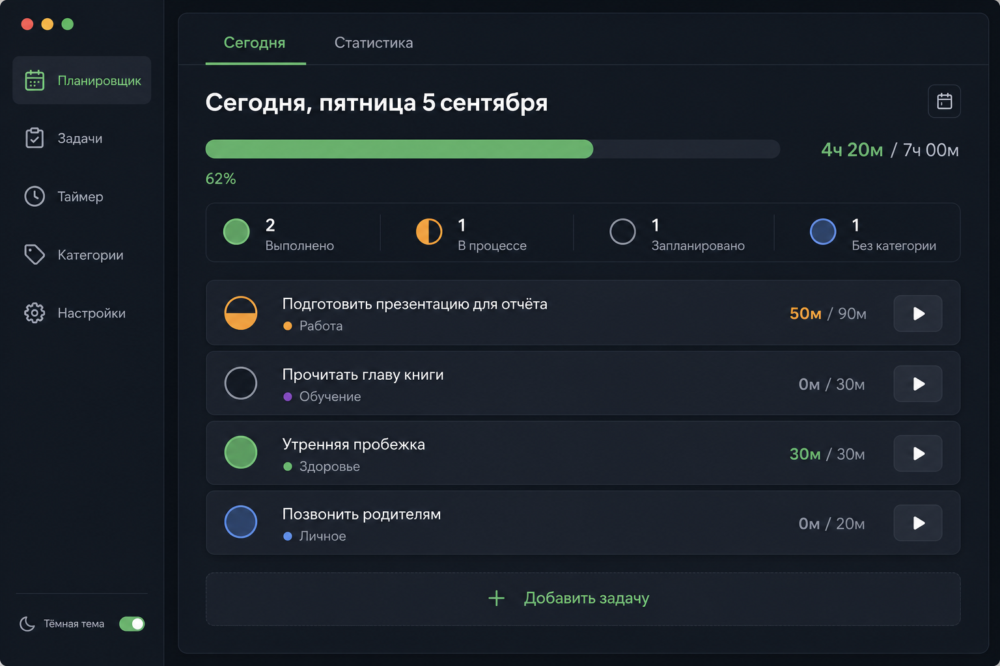
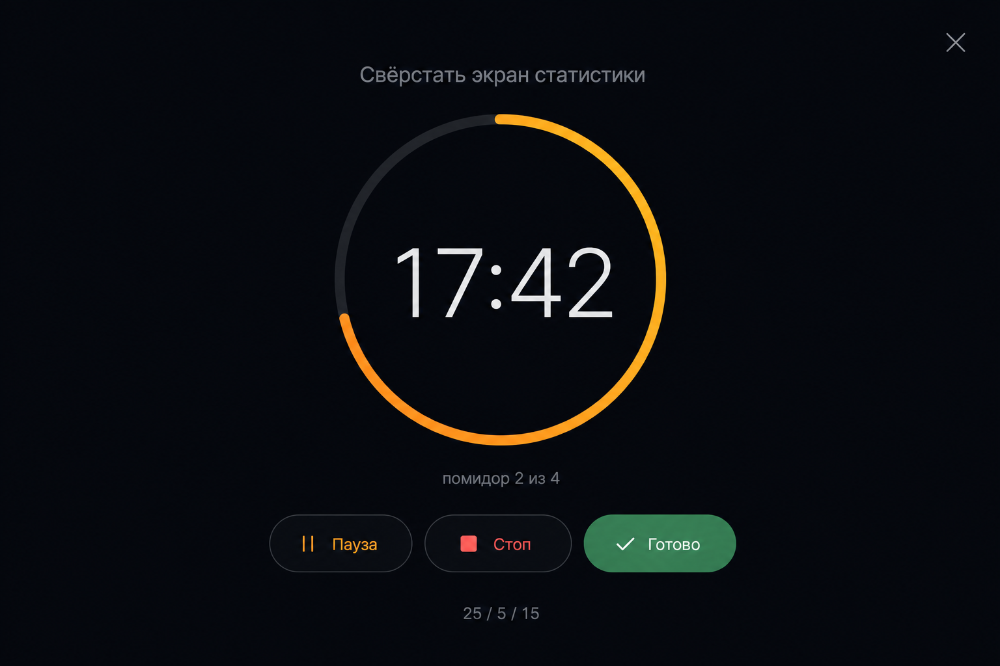
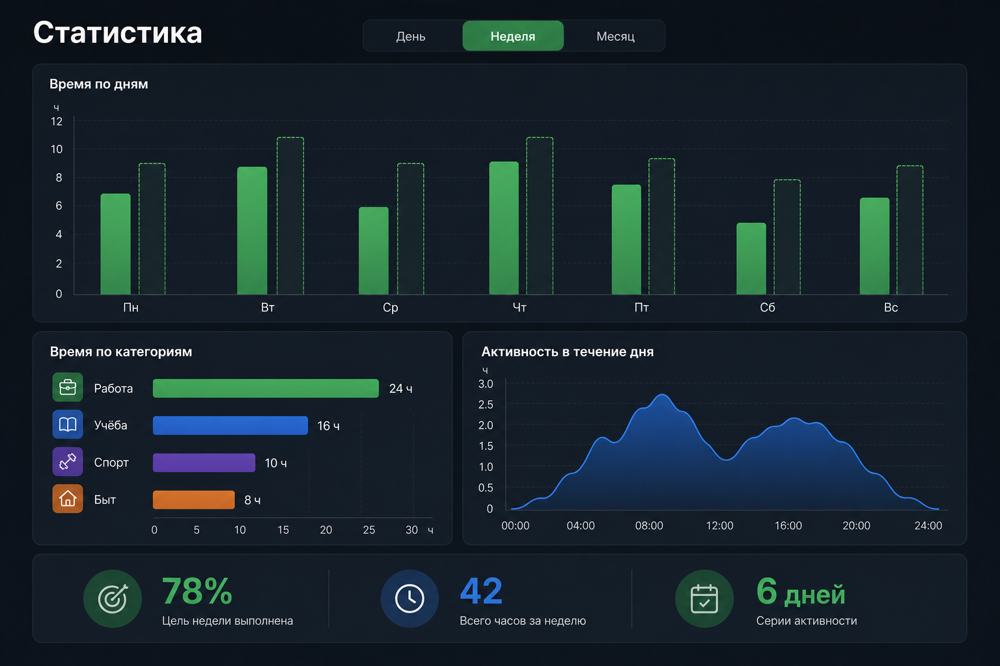
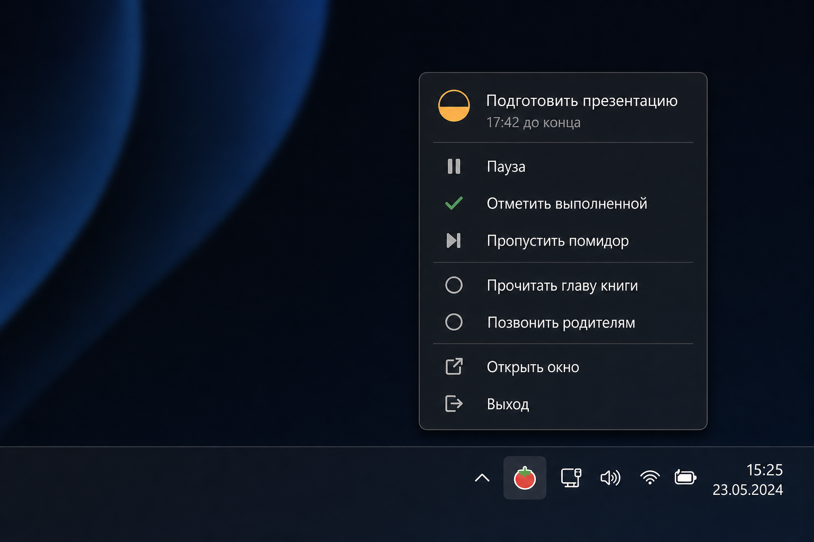

# Tracker_DayPlan — концепт прототипа

> Статус: обсуждение. Кода нет, только договорённости.

## 1. Идея одной фразой

Личный трекер дня: планируешь задачи → работаешь по таймеру (помодоро) → отмечаешь
статус маркером → видишь график, куда реально ушёл день.

Ключевое отличие от обычного тудушника: **план vs факт**. Мы храним не только
«сделано/не сделано», но и сколько времени реально потрачено.

## 2. Три опоры продукта

| Опора | Что делает | Зачем |
|---|---|---|
| Планировщик | список/расписание задач на день | что делать |
| Таймер | помодоро-сессии, привязанные к задаче | как делать |
| Статистика | графики за день/неделю | что получилось |

Все три связаны одной сущностью — **задачей**. Таймер пишет время в задачу,
статистика читает время из задач. Это то, что делает продукт цельным.

## 3. Статусы задач (маркеры)

Ты просил «выполненные помечаются определённым маркером». Предлагаю не бинарно,
а 5 состояний — так статистика становится честной:

| Маркер | Статус | Смысл |
|---|---|---|
| `○` | Запланировано | лежит в плане, не начато |
| `◐` | В работе | сейчас идёт таймер |
| `●` | Выполнено | закрыто полностью |
| `◒` | Частично | начал, не доделал, переносим |
| `✕` | Отменено | отпало, не считаем провалом |
| `→` | Перенесено | ушло на завтра (авто при закрытии дня) |

Цветовая логика: выполнено — зелёный, в работе — янтарный, отменено — серый
(не красный: отмена это нормально), перенесено — синий.

Открытый вопрос №1: нужен ли `◒` «частично», или это усложнение? Моё мнение —
нужен, иначе «сделал 40 минут из часа» превращается в ложный провал.

## 4. Сущности данных

```
Task
  id, title, note
  status: planned | active | done | partial | cancelled | moved
  priority: low | normal | high
  category_id            (Работа / Учёба / Спорт / Быт / Личное)
  planned_minutes        сколько заложил
  spent_minutes          сумма сессий таймера (считается, не вводится)
  date                   на какой день
  order                  позиция в списке
  created_at, done_at

Session                  одна помидорка
  id, task_id
  started_at, ended_at
  duration_minutes
  type: focus | short_break | long_break
  completed: bool        досидел или прервал

Category
  id, name, color, icon

Day
  date
  planned_total, spent_total
  note / рефлексия одной строкой
```

Важное решение: `spent_minutes` — **производное поле**, источник правды это
`Session`. Иначе статистика начнёт врать при любой правке.

## 5. Экраны

### 5.1 «Сегодня» — главный

```
┌──────────────────────────────────────────────────────┐
│  Сегодня, пятница 5 сентября        [Сегодня][Стата] │
├──────────────────────────────────────────────────────┤
│  ▓▓▓▓▓▓▓▓▓▓▓▓░░░░░░░░░░  4ч 20м / 7ч 00м   62%       │
│  ● 5   ◐ 1   ○ 3   ✕ 1                               │
├──────────────────────────────────────────────────────┤
│  ◐  Свёрстать экран статистики        50м / 90м  ▮   │
│     ● Работа · высокий                               │
│                                                      │
│  ○  Разобрать почту                    — / 20м       │
│     ● Работа                                         │
│                                                      │
│  ●  Тренировка                        45м / 45м      │
│     ● Спорт                                          │
│                                                      │
│  ◒  Дочитать главу                    15м / 60м      │
│     ● Учёба · перенести на завтра →                  │
│                                                      │
│  +  Добавить задачу                                  │
└──────────────────────────────────────────────────────┘
```

Взаимодействия: клик по маркеру → циклическая смена статуса; клик по `▮` →
запустить/остановить таймер на этой задаче; drag&drop — порядок.

### 5.2 Таймер (фокус-режим)

Не отдельная страница, а полноэкранная накладка — чтобы не терять контекст.

```
┌──────────────────────────────────────────────────────┐
│                                                  ✕   │
│               Свёрстать экран статистики             │
│                                                      │
│                      ╭─────────╮                     │
│                      │  17:42  │   ← кольцо прогресса│
│                      ╰─────────╯                     │
│                    помидор 2 из 4                    │
│                                                      │
│              [ Пауза ]   [ Стоп ]   [ ✓ Готово ]     │
│                                                      │
│              25 / 5 / 15 · long break каждые 4       │
└──────────────────────────────────────────────────────┘
```

Правила: прерванная сессия всё равно записывается (`completed: false`) — время
было потрачено. По окончании фокуса — звук + предложение начать перерыв.

Открытый вопрос №2: жёсткий помодоро (25 мин) или свободный секундомер? Предлагаю
поддержать оба: переключатель «Помодоро / Секундомер», данные пишутся одинаково.

### 5.3 Статистика

```
┌──────────────────────────────────────────────────────┐
│  Статистика            [День] [Неделя] [Месяц]       │
├──────────────────────────────────────────────────────┤
│  Время по дням (план ░ / факт ▓)                     │
│   6ч │        ▓                                      │
│   4ч │  ▓  ░  ▓  ▓     ▓                             │
│   2ч │  ▓  ▓  ▓  ▓  ▓  ▓  ░                          │
│      └──Пн─Вт─Ср─Чт─Пт─Сб─Вс                         │
├──────────────────────────────────────────────────────┤
│  По категориям         │  Активность по часам         │
│   Работа   ████ 12ч    │   ▁▃▅█▇▄▂▁▂▅▆▃▁              │
│   Учёба    ██   5ч     │   9 11 13 15 17 19 21        │
│   Спорт    █    3ч     │                              │
├──────────────────────────────────────────────────────┤
│  Выполнено 78%  ·  Помидоров 42  ·  Серия 6 дней 🔥   │
└──────────────────────────────────────────────────────┘
```

Три графика максимум. Больше — не читается.

## 6. Что НЕ делаем в прототипе

Чтобы не утонуть: без аккаунтов, без синхронизации между устройствами, без
шаринга, без подзадач и тегов, без интеграций с календарём, без мобильного
приложения. Всё это — потом, если идея зайдёт.

## 7. Этапы

| Этап | Содержание | Результат |
|---|---|---|
| 0 | этот документ, согласование | понятный скоуп |
| 1 | статичный кликабельный макет | видно, как выглядит |
| 2 | планировщик: CRUD задач + маркеры | можно вести день |
| 3 | таймер + запись сессий | появляется факт |
| 4 | статистика на реальных данных | появляется смысл |
| 5 | закрытие дня, перенос, серии | появляется привычка |

## 8. Десктоп: Windows .exe

Решение: приложение локальное, офлайн, без сервера. Данные не покидают ПК.

### 8.1 Стек

**Tauri 2 + React + TypeScript + SQLite.**

| Вариант | .exe | RAM | Плюс | Минус |
|---|---|---|---|---|
| **Tauri** | 5–15 МБ | ~100 МБ | лёгкий, UI = веб | оболочка на Rust |
| Electron | 80–150 МБ | 300+ МБ | всё на JS | тяжёлый для трея |
| .NET + Avalonia | 30–60 МБ | ~80 МБ | нативный | UI на XAML, слабее графики |

Почему Tauri: фронтенд остаётся обычным веб-приложением. Если позже захочется
браузерную версию или PWA — переиспользуется ~90% кода, меняется только слой
хранения. Rust-части почти нет: вся логика (задачи, таймер, подсчёты) живёт во
фронтенде, Rust отвечает за файл БД, трей и уведомления.

Графики — Recharts, готовое и красивое из коробки.

### 8.2 Что добавляет десктоп

- **Трей.** Крестик сворачивает в трей, а не закрывает: таймер должен тикать при
  закрытом окне. В иконке — остаток времени.
- **Системные уведомления.** Конец помидорки — toast Windows, не окошко внутри
  приложения (ты в этот момент в другой программе).
- **Автозапуск** при старте системы — иначе трекер забывают открывать.
- **Глобальные горячие клавиши** — старт/пауза, не переключаясь в окно.
- **Детект простоя.** Приложение видит бездействие → вечером само предлагает
  закрыть день.

### 8.3 Хранение

БД по умолчанию в `%APPDATA%/TrackerDayPlan/data.db`, но **путь настраиваемый**:
положил файл в папку Dropbox / Яндекс.Диска — получил синхронизацию между
домашним и рабочим ПК без всякого бэкенда. Плюс экспорт в CSV/JSON.

### 8.4 Четвёртый экран — трей-меню

```
        ┌────────────────────────────┐
        │ ◐ Свёрстать статистику     │
        │   17:42 до конца           │
        ├────────────────────────────┤
        │ ⏸  Пауза                   │
        │ ✓  Отметить выполненной    │
        │ ⏭  Пропустить помидор      │
        ├────────────────────────────┤
        │ ○ Разобрать почту          │
        │ ○ Созвон с командой        │
        ├────────────────────────────┤
        │    Открыть окно            │
        │    Выход                   │
        └────────────────────────────┘
```

### 8.5 Подводные камни

- **SmartScreen.** Неподписанный .exe Windows встретит синим окном «Защита
  Windows предотвратила запуск». Для себя — «Подробнее → Всё равно выполнить».
  Для раздачи людям нужен сертификат подписи (платный, ежегодно).
- **WebView2** предустановлен в Windows 10/11, на старых системах ставится
  довеском.
- **Автообновление** у Tauri есть, но требует подписи. Для прототипа — просто
  выкладывать новый .exe.

## 9. Мокапы

Визуализации концепта (AI-мокапы, не скриншоты реального приложения — служат
ориентиром по композиции и стилю):

| Экран | Файл |
|---|---|
| Сегодня — главный |  |
| Таймер (фокус-режим) |  |
| Статистика |  |
| Трей-меню |  |

Что мокапы добавили к текстовому описанию и стоит забрать в дизайн:

- **Левый сайдбар** с разделами (Планировщик / Задачи / Таймер / Категории /
  Настройки) — в ASCII-макете его не было, но для десктопа это правильнее, чем
  верхние табы. Окно широкое, вертикальное меню использует место лучше.
- **Строка счётчиков статусов** отдельным блоком под прогресс-баром — читается
  лучше, чем строка `● 5 ◐ 1 ○ 3`.
- **Иконки категорий** (портфель, книга, гантель, дом) вместо просто цветных
  точек — быстрее считываются в списке.
- Палитра: фон `#1a1d24`, зелёный — выполнено/прогресс, янтарный — в работе,
  синий — учёба/нейтральное, фиолетовый и оранжевый — прочие категории.

## 10. Вопросы к тебе

1. Задачи — плоский список с приоритетом или привязка к времени (09:00–10:30)?
   Расписание красивее, но жёстче и чаще ломается.
2. Помидоро фиксированный или настраиваемый + секундомер?
3. Нужны ли повторяющиеся задачи (каждый будний день)? Это мостик к привычкам.
4. Что делать с невыполненным в конце дня: спрашивать при «закрытии дня» или
   молча переносить?
5. Тон интерфейса: строгий рабочий инструмент или мягкий с эмодзи и «серией»?
6. Тёмная тема — сразу или потом?
